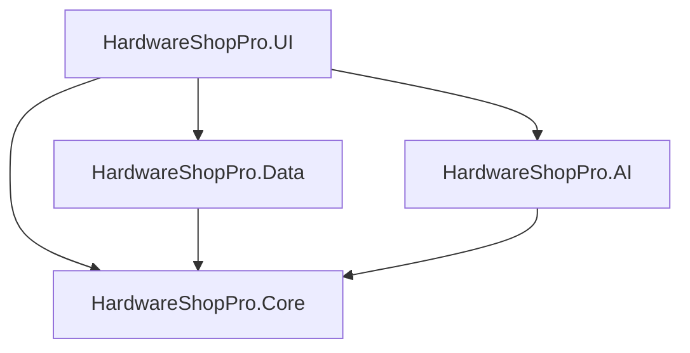

# Project Architecture

**NepalKhata (HardwareShopPro)** is built using a clean, modular **MVVM (Model-View-ViewModel)** architecture on **.NET 8**.

## Project Structure

The solution consists of four primary projects located in the `src/` directory:

| Project | Type | Description |
| :--- | :--- | :--- |
| `HardwareShopPro.Core` | Class Library | Contains domain models, enums, repository interfaces, and core services (Auth/Audit). |
| `HardwareShopPro.Data` | Class Library | Handles data persistence using SQLite and Dapper. Contains repository implementations and database migration/seeding logic. |
| `HardwareShopPro.AI` | Class Library | Manages external AI integrations (Anthropic Claude API) for smart features. |
| `HardwareShopPro.UI` | WPF Application | The presentation layer. Contains Windows, Views, and ViewModels styled with MaterialDesignThemes. |

## Technology Stack

- **Framework:** .NET 8.0 Windows (WPF)
- **Primary Language:** C# 12
- **Data Access:** [Dapper ORM](https://github.com/DapperLib/Dapper) (High performance, low overhead)
- **Database:** [SQLite](https://www.sqlite.org/) (Embedded, zero-configuration)
- **Theming:** [Material Design in XAML](http://materialdesigninxaml.net/)
- **Charts:** [LiveCharts2](https://livecharts.dev/)
- **MVVM Helpers:** [CommunityToolkit.Mvvm](https://learn.microsoft.com/en-us/dotnet/communitytoolkit/mvvm/)
- **Logging:** [Serilog](https://serilog.net/) (Structured logging to file)
- **Security:** [BCrypt.Net-Next](https://github.com/BcryptNet/bcrypt.net) (Password hashing)

## Architecture Diagram

- **Core** is the central dependency; it has no knowledge of the other layers.
- **Data** and **AI** implement interfaces defined in **Core**.
- **UI** acts as the composition root, bootstrapping the application using Dependency Injection.
